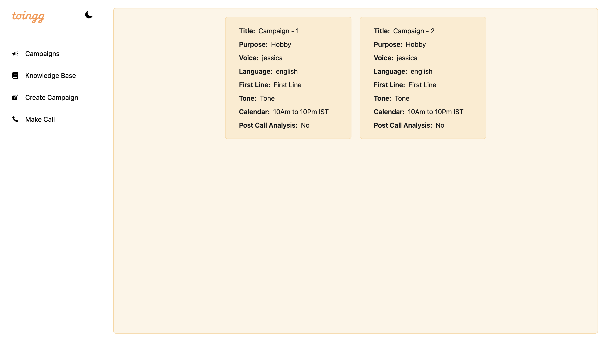
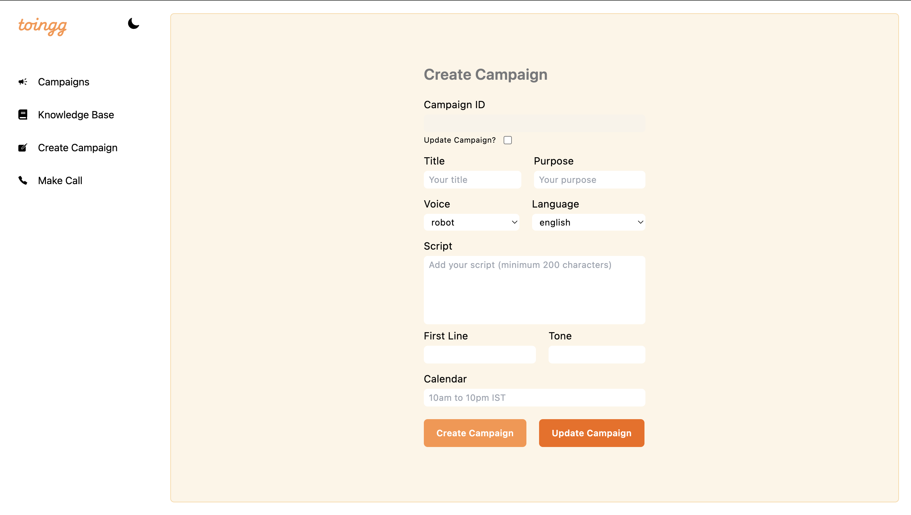
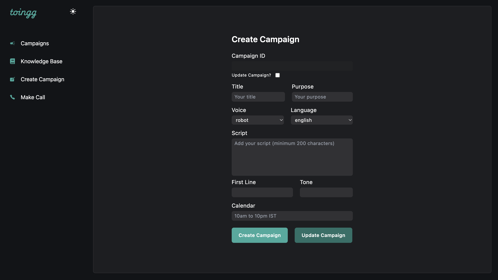

# Documentation of the Toingg Assignment

## How to run the assignment?

You can clone this repository and run it locally or you can use github codespace to run as well.

**Cloning** -

`1. git clone https://github.com/awake141327/toingg-assignment.git`

`2. cd toingg-assignment`

`3. npm install`

`4. npm run dev`

**Make sure to generate and use your own API_KEY to run the app.**

After Succesfully running the app you should see the main screen at http://localhost:5173/

<!--  -->

## Themes

This web app includes Light & Dark Theme which you can use by clicking on the moon icon on the topright of the sidebar.

### Light Theme -

Inspired by the toingg.com website.

### Dark Theme -

Inspired by the VAPI dashboard.

## Pages & Routing

There are four different pages.

1. Campaign List
2. Knowledge Base
3. Create Campaign
4. Make Calls

**Campaign List** - It displays all the campaigns created within cards.

**Knowledge Base** - You can upload the content to be given to the assistant as its base.

**Create Campaign** - Here you can create and update the campaign's data.

**Make Calls** - To make calls and access the status and transcriptions (Not Completed).

All the pages use a basic **Sidebar Layout**.

## Contexts

There are two contexts created.

1. ThemeContext
2. CampaignContext

**ThemeContext** - It manages the state of the theme throughout the app.

**CampaignContext** - It manages the state of all the campaigns created.

## Components

Two Components used.

1. **Layout** - It helps in deciding which Outlet page to display.
2. **Sidebar** - To display the sidebar of the app.
